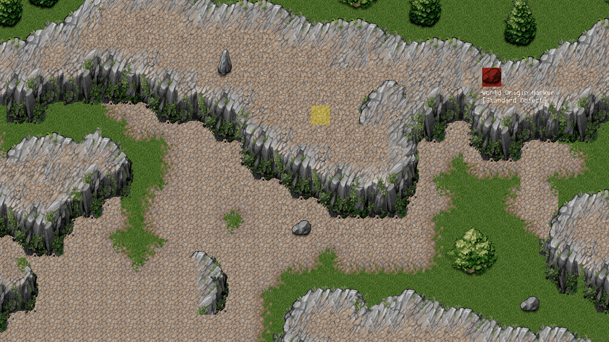

Shader-based tilemap rendering using [orx game engine](http://orx-project.org).
===============================================================================

https://www.youtube.com/watch?v=THqux-iA0nE

N.B.: Most of the C/C++ code is for converting the tilemap data to a texture format, which would normally be done during an offline process.
